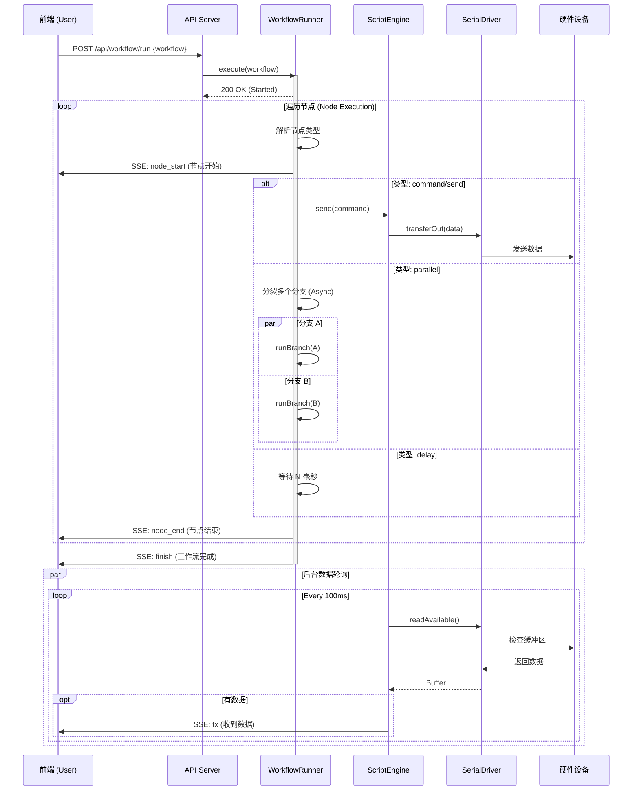

# FlowHost

* 1. [架构流程](#first)
    * 1.1. [架构流程图](#firstPOne)
    * 1.2. [架构说明](#firstPTwo)
* 2. [功能](#second)
    * 2.1. [物理串口通讯](secondPOne)
    * 2.1. [工作流编辑](secondPTwo)

*一定能成!*

## 1.   架构流程
### 1.1.  架构流程图

### 1.1.  架构说明

## 2.   功能
### 2.1.  物理串口通讯
### 2.2.  工作流编辑