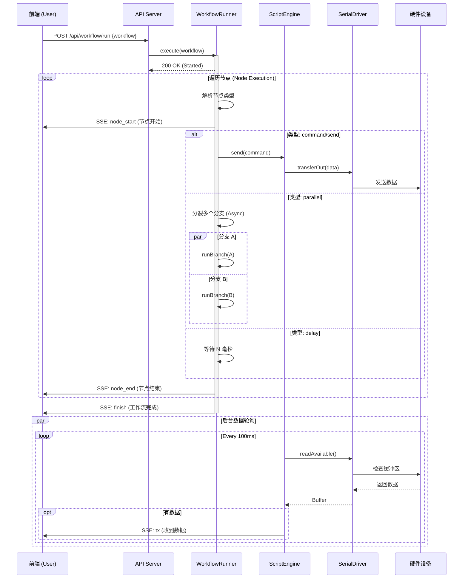
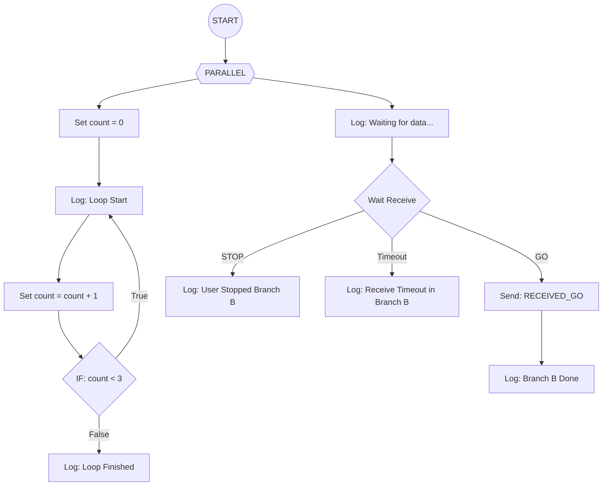

# FlowHost

* 1. [架构流程](#first)
    * 1.1. [架构流程图](#firstPOne)
    * 1.2. [架构说明](#firstPTwo)
* 2. [功能](#second)
    * 2.1. [物理串口通讯](#secondPOne)
    * 2.2. [工作流编辑](#secondPTwo)
* 3. [随记](#third)

*项目地址： https://github.com/Gou-nie/flowHost*

## 1.   架构流程
### 1.1.  架构流程图

```mermaid
sequenceDiagram
    participant User as 前端 (User)
    participant API as API Server
    participant WR as WorkflowRunner
    participant SE as ScriptEngine
    participant Driver as SerialDriver
    participant Device as 硬件设备

    %% 启动阶段
    User->>API: POST /api/workflow/run {workflow}
    API->>WR: execute(workflow)
    activate WR
    WR-->>API: 200 OK (Started)
    
    %% 节点执行循环
    loop 遍历节点 (Node Execution)
        WR->>WR: 解析节点类型
        WR->>User: SSE: node_start (节点开始)
        
        alt 类型: command/send
            WR->>SE: send(command)
            SE->>Driver: transferOut(data)
            Driver->>Device: 发送数据
        else 类型: parallel
            WR->>WR: 分裂多个分支 (Async)
            par 分支 A
                WR->>WR: runBranch(A)
            and 分支 B
                WR->>WR: runBranch(B)
            end
        else 类型: delay
            WR->>WR: 等待 N 毫秒
        end
        
        WR->>User: SSE: node_end (节点结束)
    end
    
    %% 结束
    WR->>User: SSE: finish (工作流完成)
    deactivate WR

    %% 数据接收 (独立轮询进程)
    par 后台数据轮询
        loop Every 100ms
            SE->>Driver: readAvailable()
            Driver->>Device: 检查缓冲区
            Device-->>Driver: 返回数据
            Driver-->>SE: Buffer
            opt 有数据
                SE->>User: SSE: tx (收到数据)
            end
        end
    end
```

### 1.1.  架构说明

## 2.   功能
### 2.1.  物理串口通讯
### 2.2.  工作流编辑

```mermaid
graph TD
    1(("START"))
    2{{"PARALLEL"}}
    10["Set count = 0"]
    11["Log: Loop Start"]
    12["Set count = count + 1"]
    13{"IF: count < 3"}
    14["Log: Loop Finished"]
    20["Log: Waiting for data..."]
    21{"Wait Receive"}
    22["Send: RECEIVED_GO"]
    23["Log: Branch B Done"]
    24["Log: User Stopped Branch B"]
    25["Log: Receive Timeout in Branch B"]
    1 --> 2
    2 --> 10
    2 --> 20
    10 --> 11
    11 --> 12
    12 --> 13
    13 -->|True| 11
    13 -->|False| 14
    20 --> 21
    21 -->|GO| 22
    21 -->|STOP| 24
    21 -->|Timeout| 25
    22 --> 23


```

## 3.   随记
 &emsp;&emsp;这个想法是由下面多个小事情串起来的：
 &emsp;&emsp;&emsp;&emsp;1、HaxIOX / Portax项目，来自C语言群群友分享。知道了浏览器 Web Serial API里开放了USB串口的权限。 
 &emsp;&emsp;&emsp;&emsp;2、Mermaid流程图绘制框架，这个是写文档时组长推荐的。
 &emsp;&emsp;&emsp;&emsp;3、工作的时候看到pipeline的工作流。
 &emsp;&emsp;于是做了这个专为串口通信任务设计的工作流自动化引擎。使用trae的周年福利问了AI来做，几个小事件激发一个想法然后在AI加持下两周摸鱼时间摸出来，感觉还是挺有成就感的。推荐大家了解一下vibeCoding。

